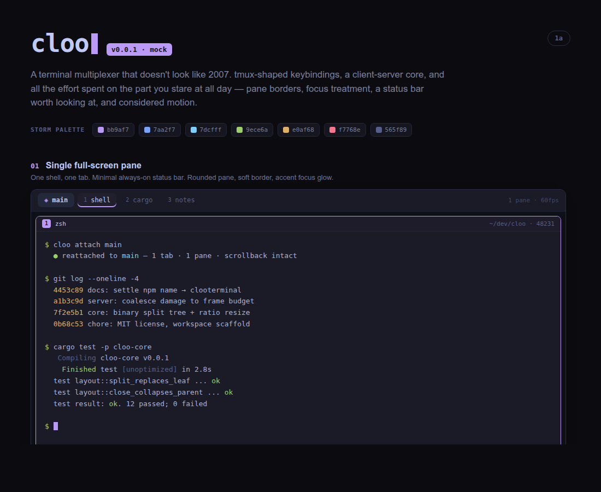
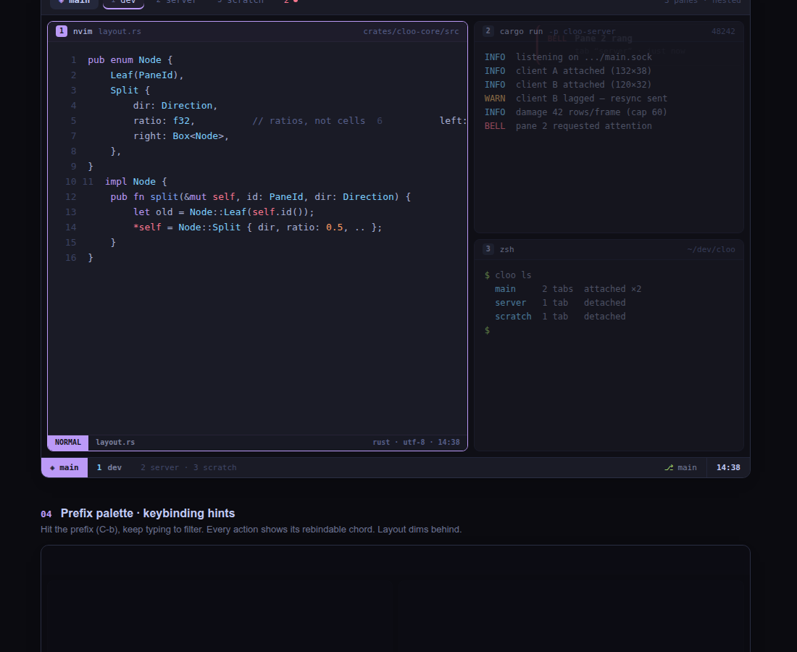

<div align="center">

# cloo

### A terminal multiplexer for the way coding work looks now.

<sub>Persistent sessions. Intentional terminal chrome. A calm workspace for many coding agents.</sub>

<br><br>

<code>PRE-ALPHA</code>&nbsp;&nbsp;·&nbsp;&nbsp;<code>RUST</code>&nbsp;&nbsp;·&nbsp;&nbsp;<code>MACOS + LINUX</code>&nbsp;&nbsp;·&nbsp;&nbsp;<code>LOCAL-FIRST</code>

</div>

<br>

<p align="center">
  
</p>

> **Not usable yet.** cloo is in the early implementation phase. The visual system, architecture,
> and v1 workboard are complete; the current binary only prints help. This README shows the intended
> product direction, not a shipped interface.

## The idea

cloo is a client-server terminal multiplexer written in Rust. A daemon owns your PTYs, grids,
scrollback, and layout; thin clients attach over a Unix socket. Close a terminal, reattach later,
and the work is still there.

The difference is where cloo puts its attention: the interface you spend all day looking at. It is
being designed as a workspace for several concurrent coding harnesses—especially Codex and Claude
Code—not just as a better-looking shell container.

## What it is intended to feel like

| | |
|---|---|
| **Know what needs you** | Named panes, task labels, and a compact attention queue make it possible to find the one agent that needs input without reading every transcript. |
| **Keep the terminal intact** | Sessions survive client death; split ratios survive resize; normal shell and TUI behavior stay first-class. |
| **Move through dense work calmly** | Accent focus, dimmed neighbors, one-row chrome, pane zoom, and short interruptible motion give multi-pane work a clear visual hierarchy. |
| **Degrade deliberately** | 16-color terminals remain legible. Richer terminal effects are capability-gated, and optional graphics never break a pane. |

## Intended workspace

<p align="center">
  
</p>

The intended v1 experience includes:

- Durable sessions with detach/reattach and multi-client attach
- Binary splits, tabs, directional focus, resize, and pane zoom
- Explicit local launch profiles for a shell, Codex, and Claude Code
- Attention states sourced from lifecycle events, bells, user actions, or opt-in local adapters—never brittle transcript scraping
- An always-on minimal status bar, command palette, session switcher, and keyboard-first navigation
- Bracketed paste, extended keys, focus, alternate screen, and mouse compatibility for modern terminal UIs
- Copy mode, scrollback search, and policy-controlled OSC 52 clipboard support
- TOML configuration, live reload, named themes, terminal palette inheritance, and reduce-motion support

## Design principles

<table>
  <tr>
    <td width="33%"><strong>State belongs to the server</strong><br><sub>Clients cache visible grids and render chrome; they never become the source of truth.</sub></td>
    <td width="33%"><strong>Chrome belongs to the client</strong><br><sub>The server sends content and geometry. Themes and visual identity stay local to the renderer.</sub></td>
    <td width="33%"><strong>Agent state is explicit</strong><br><sub>cloo stores a state and its source. It does not pretend an ANSI transcript is a reliable API.</sub></td>
  </tr>
</table>

## Project status

| Track | Current state |
|---|---|
| Product and UI direction | Settled—the Storm visual system, focus treatment, status bar, theming, and motion rules are documented. |
| Agent-workspace contract | Settled—profiles, attention state, compatibility tiers, and safe terminal-effect handling are specified. |
| Implementation | Beginning—42 bounded M0–M7 tasks are ready in the workboard. |
| Runtime | Placeholder only—the command is not ready for real sessions. |

## Follow the build

- [Product requirements and roadmap](docs/PRD.md)
- [Architecture](docs/ARCHITECTURE.md)
- [Terminal style guide](docs/STYLEGUIDE.md)
- [Agent workflows and compatibility](docs/AGENT_WORKFLOWS.md)
- [V1 implementation workboard](docs/workboard.json)
- [UI handoff and source mock](references/design_handoff_cloo_ui/README.md)

## Installation

Not yet installable. The planned distribution is:

```sh
npm install -g clooterminal   # prebuilt binaries
cargo install cloo            # build from source
```

Both will install the `cloo` command. The npm package is named `clooterminal` because npm rejects
`cloo` through its package-name similarity filter.

## Platforms

macOS and Linux. Windows is out of scope for v1.

## License

MIT — see [LICENSE](LICENSE).
