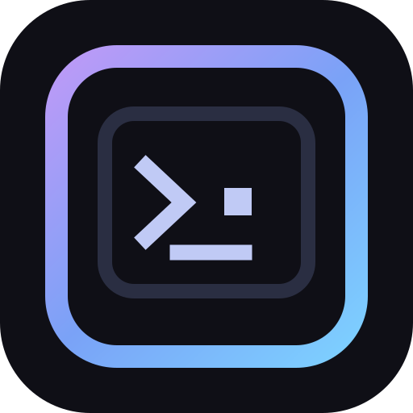
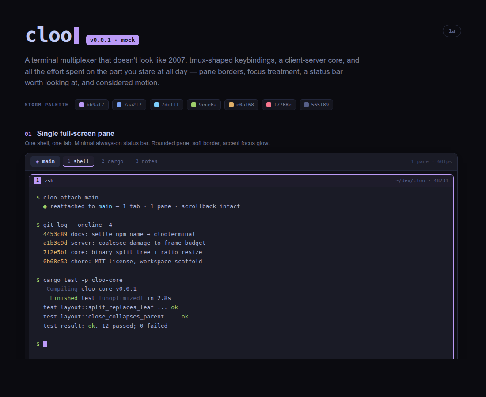
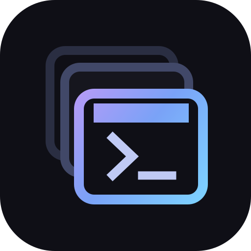
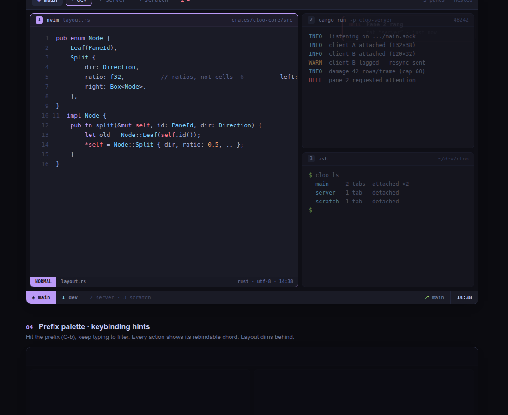
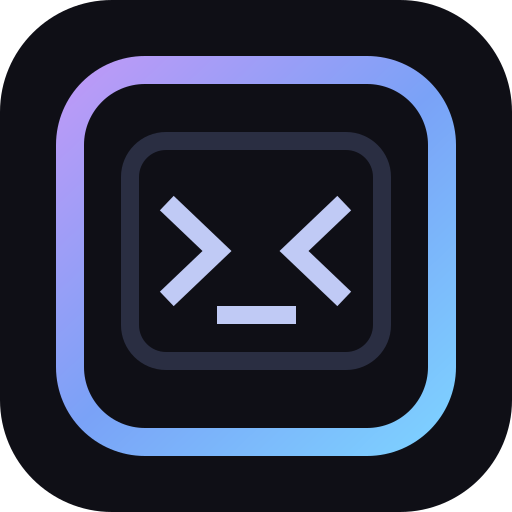

<div align="center">



# cloo

### A terminal multiplexer for the way concurrent coding work looks now.

<sub>Persistent sessions · intentional terminal chrome · a calm workspace for many coding agents</sub>

<br><br>

<code>PRE-ALPHA</code>&nbsp;&nbsp;·&nbsp;&nbsp;<code>RUST</code>&nbsp;&nbsp;·&nbsp;&nbsp;<code>LINUX X64</code>&nbsp;&nbsp;·&nbsp;&nbsp;<code>LOCAL-FIRST</code>

</div>

<br>

<p align="center">
  
</p>

> **Pre-alpha, but executable.** Today plain `cloo` opens the persistent `default` workspace,
> starting its daemon in the background the first time and attaching through the multi-pane client;
> `cloo <program>` still runs one local pane with real PTY, raw-mode, resize, and terminal-emulation
> handling; and `cloo server [session]` / `cloo attach [session]` remain the explicit halves. This
> is not a released package or a replacement for tmux yet.

> **Visual status:** the images in this README are the approved handoff. As of M9 all eight of its
> states are implemented in the live attached client, each asserted by a reviewed cell golden and by
> a fixture that drives the shipped binary over a real pseudoterminal. Where a terminal cell cannot
> express a treatment — rounded corners, shadows, pixel gaps, a chosen typeface — cloo draws the
> documented [cell equivalent](docs/STYLEGUIDE.md#intentional-terminal-adaptations) instead.

## The idea

cloo is a client-server terminal multiplexer written in Rust. A daemon owns your PTYs, grids,
scrollback, and layout; thin clients attach over a Unix socket. Close a terminal, reattach later,
and the work is still there.

The difference is where cloo puts its attention: the interface you spend all day looking at. It is
being designed as a workspace for several concurrent coding harnesses—especially Codex and Claude
Code—not just as a better-looking shell container.

## The product direction

| | |
|---|---|
| **Know what needs you** | Named panes, task labels, and a compact attention queue make it possible to find the one agent that needs input without reading every transcript. |
| **Keep the terminal intact** | Sessions survive client death; split ratios survive resize; normal shell and TUI behavior stay first-class. |
| **Move through dense work calmly** | Accent focus, dimmed neighbors, one-row chrome, pane zoom, and short interruptible motion give multi-pane work a clear visual hierarchy. |
| **Degrade deliberately** | 16-color terminals remain legible. Richer terminal effects are capability-gated, and optional graphics never break a pane. |

## Intended workspace

<p align="center">
  
</p>

<p align="center">
  
</p>

The intended v1 experience includes:

- Durable sessions with detach/reattach and multi-client attach
- Binary splits, tabs, directional focus, resize, and pane zoom
- Explicit local launch profiles for a shell, Codex, and Claude Code
- Attention states sourced from lifecycle events, bells, user actions, or opt-in local adapters—never brittle transcript scraping
- An always-on minimal status bar, command palette, session switcher, and keyboard-first navigation
- Bracketed paste, extended keys, focus, alternate screen, and mouse compatibility for modern terminal UIs
- Copy mode, scrollback search, and policy-controlled OSC 52 clipboard support
- TOML configuration, live reload, named themes, terminal palette inheritance, and reduce-motion support

## Agent-aware workflows

<p align="center">
  
</p>

cloo treats coding harnesses as ordinary programs with explicit, attributable workflow signals.
Profiles, optional local adapters, and the attention queue help people coordinate Codex and Claude
Code without inferring their state from terminal text.

## Design principles

<table>
  <tr>
    <td width="33%"><strong>State belongs to the server</strong><br><sub>Clients cache visible grids and render chrome; they never become the source of truth.</sub></td>
    <td width="33%"><strong>Chrome belongs to the client</strong><br><sub>The server sends content and geometry. Themes and visual identity stay local to the renderer.</sub></td>
    <td width="33%"><strong>Agent state is explicit</strong><br><sub>cloo stores a state and its source. It does not pretend an ANSI transcript is a reliable API.</sub></td>
  </tr>
</table>

## Project status

| Track | Current state |
|---|---|
| Product and identity | Settled—the high-fidelity handoff is the terminal UI acceptance contract, and the external [brand system](docs/BRANDING.md) remains separate from terminal chrome. |
| Core and workspace model | Implemented and tested—PTY ownership, daemon/socket lifecycle, layouts, profiles, attention data, tabs, copy mode, mouse behavior, attached rendering, compatibility fixtures, and supported-target packaging are in place. |
| What runs today | Plain `cloo` create-or-attaches the global `default` workspace; `cloo <program>` launches one local pane; `cloo server [session]` owns a foreground daemon; `cloo attach [session]` joins one with composed chrome, input routing, resize handling, and layout controls. |
| Terminal UI | Implemented and tested—M9 delivers the eight-card handoff: complete pane frames, session-aware tabs, both status compositions, live notifications, the command palette and session switcher, the active-resize affordance, and runtime visual preferences with a truthful theme preview. |
| Compatibility and release | Reconnect/capability hardening, deterministic fixtures, supported-target packaging, and the external brand system are in place. |

## Follow the build

- [Product requirements and roadmap](docs/PRD.md)
- [Architecture](docs/ARCHITECTURE.md)
- [Terminal style guide](docs/STYLEGUIDE.md)
- [Brand system and source kit](docs/BRANDING.md)
- [Maintainer npm release runbook](docs/RELEASING.md)
- [Agent workflows and compatibility](docs/AGENT_WORKFLOWS.md)
- [V1 implementation workboard](docs/workboard.json)
- [UI handoff and source mock](references/design_handoff_cloo_ui/README.md)

##  Install

```sh
npm install -g clooterminal   # prebuilt Linux x64 binary, no install hook
```

The npm package is named `clooterminal` because npm rejects `cloo` through its package-name
similarity filter; the installed command is still `cloo`. Publishing to crates.io as `cloo` is
planned but has not happened yet.

## Build locally

The current runtime can also be built and run from this repository:

```sh
cargo run -p cloo                          # open the default workspace
cargo run -p cloo -- --profile codex       # one local pane, no daemon
cargo run -p cloo -- server default        # the same daemon in the foreground, for diagnostics
```

## Platforms

The npm distribution supports Linux x64 with glibc 2.34 or newer (Ubuntu 22.04, Debian 12, RHEL 9,
and later). Older glibc distributions, macOS, and Linux ARM remain source-only; Windows is out of
scope for v1.

## License

MIT — see [LICENSE](LICENSE).
